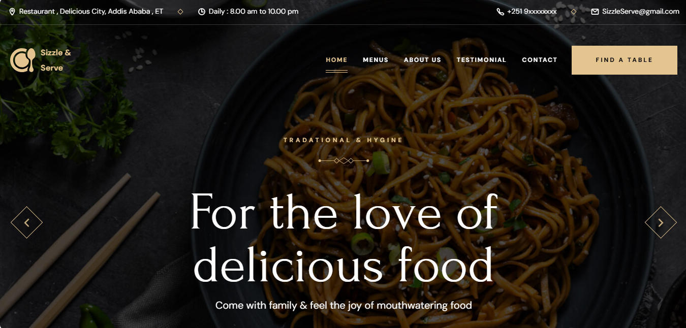
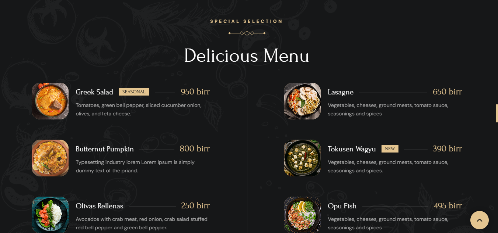
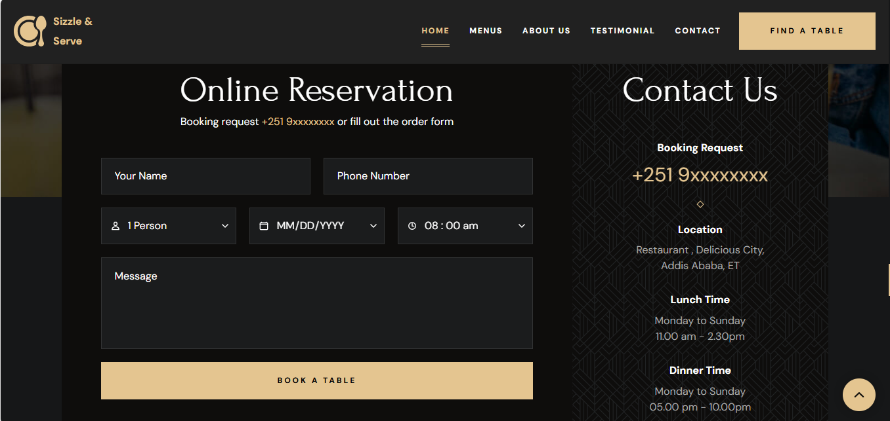

# Sizzle and Serve

Welcome to the Sizzle and Serve website! This project showcases a culinary experience, offering delicious recipes and dining inspiration.

## Table of Contents

- [Overview](#overview)
- [Features](#features)
- [Technologies Used](#technologies-used)
- [Screenshots](#screenshots)
- [Installation Guide](#installation-guide)
- [Usage](#usage)
- [Contributing](#contributing)

## Overview

Sizzle and Serve is a food website built using HTML, CSS, and JavaScript. It aims to provide users with an engaging platform to explore various recipes, dining tips, and culinary news.

## Features

- Responsive design for mobile and desktop
- Interactive elements using JavaScript
- Beautifully styled components with CSS
- Easy navigation to various sections

## Technologies Used

- HTML5
- CSS3
- JavaScript

## Screenshots


*Home Page*


*Recipe Page*


*Contact Page*

## Installation Guide

1. Clone the repository:
   ```bash
   git clone https://github.com/FetuTechTamer/restaurant-website.git
   ```

2. Navigate to the project directory:
   ```bash
   cd restaurant-website
   ```

3. Open the `index.html` file in your web browser.

## Usage

- Explore the homepage for featured dishes.
- Navigate through different sections to find recipes and tips.
- Use the contact form to reach out for inquiries.

## Contributing

Contributions are welcome! Please submit a pull request or open an issue to discuss improvements or features.

